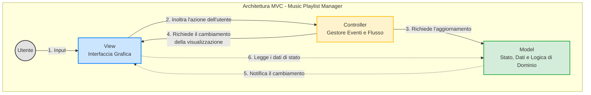

# Design Architetturale e Product Backlog

## Introduzione

Questo documento racchiude le informazioni fondamentali per lo sviluppo dell'applicazione **Music Playlist Manager**. Sono incluse le risorse utilizzate dal gruppo di sviluppo, la *definizione di completezza*, lo *schema architetturale* del sistema ed il *product backlog*

---

## 1. Risorse del Progetto

* **Linguaggio di programmazione**: Java
* **Framework UI**: JavaFX
* **Test Units**: JUnit
* **GitHub**: [Repository Gruppo - 7](https://github.com/luigi-perone/MusicPlayer.git)
* **Trello**: [Bacheca Trello](https://trello.com/invite/b/6a0c3200847d4a8a49bea685/ATTIf4eda6d2ceb3ed6cbe5037e2ab23d077E67C53A4/sad-gruppo-7)

---

## 2. Definition of Done

### Codice

* **Codice compilabile senza errori**: il progetto deve compilare correttamente con il sistema di build Maven.
* **Refactoring effettuato**: il codice deve essere stato migliorato in termini di leggibilità e manutenibilità, senza alterare il comportamento.
* **Dipendenze corrette**: tutte le librerie devono essere dichiarate correttamente nel progetto, senza conflitti.
* **Stile di codice conforme**: il codice rispetta tutte le convenzioni di stile condivise dal gruppo.

### Test

* **Unit test completi e superati**: tutti i test unitari devono essere scritti ed eseguiti con successo.
* **Test di integrazione superati**: i test di integrazione necessari devono essere presenti ed eseguiti con esito positivo.
* **Test dell'interfaccia grafica superati**: i test dell'interfaccia grafica necessari devono essere presenti ed eseguiti con esito positivo.

### Documentazione e commenti

* **JavaDoc completa e aggiornata**: classi, interfacce e metodi pubblici devono essere documentati in modo chiaro.
* **Funzionalità principali commentate**: le funzioni principali sono accompagnate da commenti chiari e concisi.

### Gestione progetto

* **Commit e push corretti**: è stato effettuato il *commit* e il *push* su Git, con messaggi chiari e coerenti.
* **User stories tracciate su Trello**: le funzionalità completate devono essere segnate come *Done* sulla bacheca di Trello.
* **Revisione di gruppo completata**: il team o parte di esso ha letto e approvato il codice risolvendo eventuali conflitti o perplessità.
* **Rispetto del principio DRY**: le nuove funzionalità incluse non sono ripetizioni o duplicazioni di codice già sviluppato.

## 3. Architettura Software Adottata

### 3.1 Scelta dell'Architettura

La struttura architetturale del sistema si basa sul pattern *Model-View-Controller (MVC)*, uno degli approcci più comuni nello sviluppo di applicazioni desktop. Esso fornisce garanzie di separazione delle responsabilità, modularità e manutenibilità del codice.

- **Model**
  Gestisce i dati e lo stato dell'applicazione (libreria dei brani, playlist, modalità di riproduzione), definisce le regole di business rimanendo completamente indipendente dalla View e dal Controller. Fornisce interfacce per la manipolazione e l'accesso allo stato, sfruttando meccanismi di notifica verso gli oggetti osservatori *(Pattern Observer)*.

- **View**
  Responsabile della presentazione grafica del modello all'utente. Visualizza le informazioni provenienti dal Model (libreria, playlist, player, home) senza conoscere la logica di aggiornamento. Cattura gli input dell'utente che interagisce con il sistema.

- **Controller**
  Riceve gli input dell'utente catturati dalla View, richiede l'esecuzione delle operazioni di modifica appropriate al Model ed aggiorna la View di conseguenza.

### 3.2 Organizzazione dei Package
Per massimizzare la coesione e ridurre l'accoppiamento, l'architettura adotta una scomposizione *Package by Feature*.
L'applicazione viene divisa in moduli che riflettono le funzionalità del sistema da realizzare (Es. `track`, `playlist`, `player`).\
Ogni package contiene al proprio interno la micro-architettura MVC: il Modello, la Vista e il Controller legato a ciascuna funzionalità.\
Così facendo, è possibile uno sviluppo indipendente delle feature e l'incapsulamento dei dettagli implementativi (nascosti attraverso la visibilità dei package). 

---

### 3.3 Diagramma Architetturale

---

## 4. Product Backlog

## [US-001] Creazione di una traccia

**story points**: 2
**priorità**: *alta*

**Come** utente,
**voglio** creare una nuova traccia inserendo titolo, autore, durata, genere e anno di pubblicazione,
**in modo da** riprodurla successivante.

**Criteri di Accettazione:**

* **Dato** che l'utente si trova nell'interfaccia principale,
  **Quando** seleziona l'opzione per aggiungere una traccia,
  **Allora** il sistema apre il form di creazione.
* **Dato** che l'utente ha aperto il form,
  **Quando** compila tutti i campi obbligatori con dati validi e conferma,
  **Allora** la traccia viene salvata e mostrata nella libreria.
* **Dato** che l'utente ha aperto il form,
  **Quando** lascia vuoto almeno un campo obbligatorio e conferma,
  **Allora** il sistema non salva la traccia **E** mostra un messaggio di errore.
* **Dato** che l'utente compila il form,
  **Quando** inserisce una durata non numerica oppure un anno non valido (Ex. maggiore dell'anno corrente) e conferma,
  **Allora** il sistema non salva la traccia **E** mostra un messaggio di errore sul formato dei dati.

**Dipendenze:**

* Nessuna

---

## [US-002] Visualizzazione delle tracce

**story points**: 1
**priorità**: *alta*

**Come** utente,
**voglio** visualizzare l'elenco di tutte le tracce della mia libreria,
**in modo che** posso vedere quali brani ho disponibili.

**Criteri di Accettazione:**

* **Quando** L'utente si trova nella vista 'Libreria' e ci sono tracce disponibili,
  **Allora** Ogni traccia nell'elenco deve mostrare gli attributi: titolo, durata, genere, autore, anno di pubblicazione.
* **Dato che** non ha ancora aggiunto nessuna traccia alla propria libreria,
  **quando** Accede alla vista Libreria,
  **allora** nell’interfaccia deve apparire un messaggio (es. _"La tua libreria è vuota. Aggiungi il tuo primo brano!"_).

**Dipendenze:**

* US-001

---

## [US-003] Modifica di una traccia

**story points**: 1
**priorità**: *alta*

**Come** utente,
**voglio** modificare i metadati di una traccia esistente,
**in modo da** correggere errori o aggiornare le informazioni.

**Criteri di Accettazione:**

* **Dato che** l'utente si trova nella libreria musicale e ha selezionato una traccia specifica,
  **Quando** clicca sul pulsante "Modifica",
  **Allora** il sistema apre un modulo pre-compilato con i dati attuali della traccia.
* **Dato che** l'utente è all'interno del modulo di modifica,
  **Quando** inserisce dati non validi (es. lascia il titolo vuoto o inserisce un anno futuro),
  **Allora** il sistema mostra un messaggio di errore.
* **Dato che** la traccia modificata può essere presente anche all'interno di una o più playlist,
  **Quando** il salvataggio dei nuovi metadati va a buon fine,
  **Allora** le nuove modifiche della traccia vengono modificati automaticamente su tutte le playlist.

**Dipendenze:**

* US-002

---

## [US-004] Eliminazione di una traccia

**story points**: 1
**priorità**: *alta*

**Come** utente,
**voglio** eliminare una traccia dalla libreria,
**affinché** possa rimuovere brani indesiderati.

**Criteri di Accettazione:**

* **Dato che** l'utente si trova nella vista della Libreria e ha individuato la traccia da rimuovere,
  **Quando** seleziona la traccia e clicca sul pulsante "Elimina",
  **Allora** il sistema non elimina subito il brano, ma mostra un messaggio di conferma (es. _"Sei sicuro di voler eliminare definitivamente questa traccia?"_).
* **Dato che** i brani possono trovarsi in una o più playlist,
  **Quando** l'utente clicca su "Conferma Eliminazione",
  **Allora** il sistema rimuove a cascata le tracce anche sulle playlist.

**Dipendenze:**

* US-002

---

## [US-005] Creazione di una playlist

**story points**: 1
**priorità**: *alta*

**Come** utente,
**voglio** creare una nuova playlist assegnandole un nome,
**in modo da** organizzare i miei brani.

**Criteri di Accettazione:**

* **Dato che** l'utente si trova nella schermata principale o nella sezione dedicata alle playlist,
  **Quando** clicca sul pulsante "Nuova Playlist" (o icona "+"),
  **Allora** il sistema apre un modulo che richiede l'inserimento del nome della playlist.
* **Dato che** l'utente si trova nel modulo di creazione,
  **Quando** inserisce un nome valido, non vuoto e non ancora utilizzato e clicca su "Crea",
  **Allora** il sistema salva la nuova playlist nel database come lista vuota, **E** chiude il modulo.

**Dipendenze:**

* Nessuna

---

## [US-006] Eliminazione di una playlist

**story points**: 1
**priorità**: *alta*

**Come** utente,
**voglio** eliminare una playlist,
**in modo da** cancellare le playlist non desiderate.

**Criteri di Accettazione:**

* **Dato che** l'utente si trova nella schermata di gestione delle playlist o all'interno di una playlist specifica,
  **Quando** clicca sul pulsante "Elimina Playlist",
  **Allora** il sistema mostra un messaggio di conferma (es. _"Sei sicuro di voler eliminare questa playlist?"_).
* **Dato che** la finestra di conferma è visibile sullo schermo,
  **Quando** l'utente clicca su "Conferma Eliminazione",
  **Allora** il sistema rimuove permanentemente la playlist dall'elenco dell'utente, **E** i brani contenuti al suo interno **non** vengono eliminati dalla libreria.

**Dipendenze:**

* US-005

---

## [US-007] Modifica di una playlist

**story points**: 1
**priorità**: *alta*

**Come** utente,
**voglio** modificare il nome di una playlist,
**in modo da** scegliere il nome che preferisco.

**Criteri di Accettazione:**

* **Dato** che l'utente si trova nella schermata della playlist,
  **Quando** clicca sul pulsante "Rinomina",
  **Allora** il nome della playlist diventa un campo di testo editabile.
* **Dato** che l'utente è in modalità modifica nome,
  **Quando** inserisce un nuovo nome valido e univoco e clicca su "Salva",
  **Allora** il nome della playlist viene aggiornato nell’elenco.
* **Dato** che l'utente è in modalità modifica nome,
  **Quando** clicca sul pulsante "Annulla",
  **Allora** il sistema esce dalla modalità di modifica e mantiene il nome originale.
* **Dato** che l'utente sta modificando il nome della playlist,
  **Quando** cancella il testo e tenta di salvare il campo vuoto,
  **Allora** il sistema blocca l'operazione e mostra un messaggio di errore.
* **Dato** che l'utente possiede già una playlist chiamata con un determinato nome,
  **Quando** tenta di rinominare la playlist attuale usando quello stesso nome,
  **Allora** il sistema impedisce il salvataggio e mostra un messaggio di errore.

**Dipendenze:**

* US-005

---

## [US-008] Visualizzazione della playlist

**story points**: 2
**priorità**: *alta*

**Come** utente,
**voglio** visualizzare una playlist,
**in modo da** visionare i brani e le informazioni relative.

**Criteri di Accettazione:**

* **Dato** che l'utente si trova nell'elenco delle sue playlist,
  **Quando** clicca sul nome di una playlist specifica,
  **Allora** viene reindirizzato alla vista dedicata di quella playlist mostrando chiaramente il nome della playlist, il numero totale di brani e la durata complessiva della playlist.
* **Dato** che la playlist selezionata contiene dei brani,
  **Quando** l'utente visualizza l'elenco interno,
  **Allora** ogni brano mostra il titolo, l'artista, la durata e la posizione numerica all'interno della playlist.
* **Dato** che l'utente ha aperto la vista di una playlist,
  **Quando** un brano viene aggiunto o rimosso da quella playlist da un'altra schermata,
  **Allora** l'elenco dei brani e i contatori globali (numero brani e durata totale) si aggiornano in tempo reale.
* **Dato** che l'utente apre una playlist appena creata o svuotata,
  **Quando** accede alla vista della playlist,
  **Allora** viene visualizzato un messaggio (es. _"Questa playlist è vuota"_) associato pulsante per aggiungere brani.

**Dipendenze:**

* US-005

---

## [US-009] Aggiunta di tracce a una playlist

**story points**: 3
**priorità**: *alta*

**Come** utente,
**voglio** aggiungere una o più tracce a una playlist esistente,
**in modo da** popolare le mie raccolte musicali.

**Criteri di Accettazione:**

* **Dato che** l'utente si trova nella Libreria musicale o in un elenco di brani,
  **Quando** seleziona una o più tracce e clicca sul comando "Aggiungi a playlist",
  **Allora** viene mostrato un menu a comparsa o una finestra con l'elenco di tutte le playlist create dall'utente.
* **Dato che** l'elenco delle playlist è visibile sullo schermo,
  **Quando** l'utente seleziona la playlist di destinazione desiderata,
  **Allora** il sistema inserisce le tracce selezionate in fondo alla playlist e mostra una notifica di successo.
* **Dato che** l'utente ha completato l'inserimento con successo,
  **Quando** naviga all'interno della playlist aggiornata,
  **Allora** i nuovi brani sono visibili nell'elenco e il contatore dei brani e la durata totale della playlist risultano incrementati.
* **Dato che** una delle tracce selezionate è già presente nella playlist di destinazione,
  **Quando** l'utente conferma l'aggiunta,
  **Allora** il sistema mostra un messaggio (es. ”brano già presente”) e non lo fa aggiungere.
* **Dato che** l'utente si trova nel modulo di selezione della playlist,
  **Quando** clicca sul pulsante "Annulla",
  **Allora** l'operazione viene interrotta e nessuna traccia viene aggiunta alla playlist.

**Dipendenze:**

* US-001
* US-005

---

## [US-010] Rimozione di tracce da una playlist

**story points**: 3
**priorità**: *alta*

**Come** utente,
**voglio** rimuovere una traccia da una playlist,
**in modo da** eliminare i brani indesiderati da una specifica playlist.

**Criteri di Accettazione:**

* **Dato che** l'utente si trova all'interno della vista dedicata di una specifica playlist,
  **Quando** individua una traccia e clicca sul pulsante "Rimuovi dalla playlist" (o icona dedicata),
  **Allora** il sistema mostra un messaggio di conferma.
* **Dato che** il messaggio di conferma è visibile sullo schermo,
  **Quando** l'utente clicca su "Conferma",
  **Allora** il sistema elimina la traccia da quella specifica playlist e aggiorna immediatamente la vista.
* **Dato che** la traccia è stata rimossa con successo dalla playlist,
  **Quando** l'interfaccia si aggiorna,
  **Allora** il contatore totale dei brani e la durata complessiva della playlist si riducono di conseguenza, mentre il brano resta comunque disponibile nella Libreria generale.
* **Dato che** il messaggio di conferma è visibile sullo schermo,
  **Quando** l'utente clicca su "Annulla",
  **Allora** l'azione viene interrotta, il messaggio si chiude e la playlist non subisce alcuna modifica.

**Dipendenze:**

* US-009

---

## [US-011] Riproduzione di una traccia singola

**story points**: 5
**priorità**: *alta*

**Come** utente,
**voglio** avviare la riproduzione di una traccia,
**affinché** possa ascoltare il brano scelto.

**Criteri di Accettazione:**

* **Dato che** l'utente si trova in qualsiasi schermata contenente un elenco di brani (Libreria, Playlist o Album),
  **Quando** clicca sul pulsante "Play" ad essa associato,
  **Allora** il sistema avvia immediatamente lo streaming audio del brano selezionato.
* **Dato che** la riproduzione della traccia è avviata con successo,
  **Quando** il brano inizia a suonare,
  **Allora** il player multimediale si attiva mostrando il titolo, l'artista, la barra di avanzamento del tempo e lo stato del pulsante principale commutato su "Pausa".
* **Dato che** un brano era già in riproduzione nel sistema,
  **Quando** l'utente decide di avviare una nuova traccia,
  **Allora** il sistema interrompe istantaneamente la riproduzione del brano precedente e avvia la nuova traccia dall'inizio.

**Dipendenze:**

* US-002

---

## [US-012] Pausa e ripresa della riproduzione

**story points**: 5
**priorità**: *alta*

**Come** utente,
**voglio** mettere in pausa e riprendere una traccia in riproduzione,
**in modo da** interrompere temporaneamente l'ascolto.

**Criteri di Accettazione:**

* **Dato che** una traccia è attualmente in riproduzione nel sistema,
  **Quando** l'utente clicca sul pulsante "Pausa",
  **Allora** il sistema interrompe immediatamente l'audio e la barra di avanzamento si blocca al secondo esatto dell'interruzione.
* **Dato che** il brano è stato messo in pausa correttamente,
  **Quando** l'audio si interrompe,
  **Allora** l'icona del pulsante principale del player cambia visivamente da "Pausa" a "Play", segnalando che la traccia è pronta per essere ripresa.
* **Dato che** una traccia si trova nello stato di pausa,
  **Quando** l'utente clicca nuovamente sul pulsante "Play",
  **Allora** l'audio riprende a suonare nello stesso secondo in cui era stato interrotto, senza ricominciare da capo.

**Dipendenze:**

* US-011

---

## [US-013] Skip alla traccia successiva/precedente

**story points**: 5
**priorità**: *alta*

**Come** utente,
**voglio** saltare alla traccia successiva o precedente,
**in modo da** navigare rapidamente tra i brani.

**Criteri di Accettazione:**

* **Dato che** l'utente sta ascoltando una traccia **E** non è l'ultima della lista,
  **Quando** clicca sul pulsante "Successivo" o “Precedente”,
  **Allora** il sistema interrompe il brano attuale e avvia la riproduzione della traccia che si trova nella posizione successiva o in quella precedente.
* **Dato che** il sistema ha completato il salto alla traccia successiva o precedente,
  **Quando** parte il nuovo brano,
  **Allora** tutti gli elementi grafici del player si aggiornano con le informazioni della nuova traccia.
* **Dato che** l'utente sta ascoltando l'ultima traccia di una playlist (e la modalità di loop è disattivata),
  **Quando** clicca sul pulsante “precedente” o "Successivo" o la traccia termina,
  **Allora** la riproduzione si interrompe, il player si azzera e i comandi grafici tornano allo stato iniziale.

**Dipendenze:**

* US-014

---

## [US-014] Riproduzione di una playlist

**story points**: 3
**priorità**: *alta*

**Come** utente,
**voglio** avviare la riproduzione di una specifica playlist,
**affinché** possa ascoltare i brani contenuti in una raccolta.

**Criteri di Accettazione:**

* **Dato che** l'utente si trova nella schermata di riepilogo delle playlist o all'interno della vista di una playlist specifica che contiene almeno un brano,
  **Quando** clicca sul pulsante "Play" della playlist,
  **Allora** il sistema carica l'intero elenco dei brani nella coda di riproduzione attiva e avvia lo streaming della prima traccia in lista.
* **Dato che** la riproduzione della playlist è avviata con successo,
  **Quando** la prima traccia inizia a suonare,
  **Allora** l'interfaccia della playlist mostra il titolo accanto al brano corrente, e il player si aggiorna con i metadati di questa traccia.
* **Dato che** un'altra playlist o un brano singolo erano precedentemente in riproduzione,
  **Quando** l'utente avvia la nuova playlist,
  **Allora** la vecchia coda di riproduzione viene interamente sovrascritta dalla nuova sequenza.
* **Dato che** l'utente tenta di avviare una playlist che non contiene alcuna traccia,
  **Quando** clicca sul pulsante "Play" della playlist,
  **Allora** il sistema impedisce l'azione e mostra un messaggio di errore (“nessun brano presente nella playlist”).
* **Dato che** l'utente ha avviato la riproduzione della playlist,
  **Quando** la traccia corrente termina,
  **Allora** il sistema avvia il brano successivo presente nella coda.

**Dipendenze:**

* US-008
* US-009
* US-011

---

## [US-015] Modalità di riproduzione: Sequential

**story points**: 3
**priorità**: *alta*

**Come** utente,
**voglio** scegliere la modalità di riproduzione sequenziale,
**in modo da** ascoltare i brani nell’ordine scelto.

**Criteri di Accettazione:**

* **Dato che** l'utente ha una coda di riproduzione attiva e il sistema si trova in modalità di riproduzione casuale,
  **Quando** l'utente disattiva il pulsante shuffle nel player,
  **Allora** il sistema disattiva la modalità casuale e ripristina istantaneamente l'ordine numerico originale dei brani all'interno della coda.
* **Dato che** la riproduzione sequenziale è attiva,
  **Quando** il brano corrente giunge al termine della sua durata,
  **Allora** il sistema carica e avvia in automatico la traccia il cui indice numerico è immediatamente successivo (n+1) rispetto a quello del brano appena terminato (n)
* **Dato che** l'utente si trova in modalità sequenziale e clicca sul comando "Successivo",
  **Quando** il sistema elabora il comando,
  **Allora** la riproduzione passa alla traccia posizionata esattamente un gradino sotto nella lista originale, senza effettuare salti casuali tra i brani.

**Dipendenze:**

* US-014

---

## [US-016] Modalità di riproduzione: Loop

**story points**: 5
**priorità**: *media*

**Come** utente,
**voglio** scegliere di riprodurre un brano o una playlist in loop,
**in modo da** riascoltare il brano o la playlist una volta terminati.

**Criteri di Accettazione:**

* **Dato che** l'utente ha una playlist in riproduzione e la modalità di ripetizione è disattivata,
  **Quando** clicca una volta sul pulsante "Ripeti" (_Loop_) nel player globale,
  **Allora** il sistema attiva la modalità "Ripeti Playlist" e l'icona del pulsante si illumina
* **Dato che** la modalità ripeti Playlist è attiva,
  **Quando** l’ultimo brano della playlist giunge al termine della sua durata,
  **Allora** il sistema non interrompe la musica, ma ricomincia automaticamente la riproduzione dalla prima traccia della playlist, riavviando il ciclo.
* **Dato che** il sistema si trova in modalità "Ripeti Playlist",
  **Quando** l'utente clicca una seconda volta sul pulsante "Ripeti",
  **Allora** la modalità passa a "Ripeti Brano Singolo" e l'icona sul player si aggiorna mostrando un indicatore specifico.
* **Dato che** la modalità "Ripeti Brano Singolo" è attiva,
  **Quando** la traccia corrente termina,
  **Allora** il sistema fa ricominciare immediatamente lo stesso identico brano dall'inizio all'infinito.

**Dipendenze:**

* US-014

---

## [US-017] Modalità di riproduzione: Shuffle

**story points**: 5
**priorità**: *media*

**Come** utente,
**voglio** scegliere di riprodurre i brani in ordine casuale,
**in modo da** non ascoltare i brani sempre nello stesso ordine.

**Criteri di Accettazione:**

* **Dato che** l'utente ha una playlist o una coda in modalità sequenziale,
  **Quando** clicca sul pulsante “shuffle” nel player globale,
  **Allora** la lista dei brani imminenti viene mescolata in modo random.
* **Dato che** un brano è esecuzione nel momento in cui viene attivato lo _Shuffle_,
  **Quando** il sistema genera la nuova sequenza casuale,
  **Allora** la riproduzione del brano corrente non subisce interruzioni o riavvii, e viene bloccato come elemento iniziale della nuova coda mescolata.
* **Dato che** la modalità casuale è attiva e un brano giunge al termine,
  **Quando** il sistema passa alla traccia successiva,
  **Allora** viene avviato il brano che segue nella coda mescolata, assicurando che nessuna traccia della lista mescolata venga replicata prima che l'intero ciclo di brani sia terminato.
* **Dato che** la modalità casuale è attiva,
  **Quando** l'utente clicca nuovamente sul pulsante "Riproduzione Casuale" per disattivarlo,
  **Allora** l'ordine della coda viene ripristinato e la navigazione dei brani successivi riprende a partire dalla posizione del brano correntemente in riproduzione.

**Dipendenze:**

* US-014

---

## [US-018] Modifica della playlist durante la riproduzione

**story points**: 8
**priorità**: *alta*

**Come** utente,
**voglio** aggiungere o rimuovere tracce da una playlist anche mentre è in riproduzione,
**in modo da** aggiornare dinamicamente la mia esperienza d'ascolto.

**Criteri di Accettazione:**

* **Dato che** una playlist è attualmente in riproduzione e l'utente si trova a metà dell'ascolto,
  **Quando** l'utente aggiunge una nuova traccia a questa playlist dalla libreria generale,
  **Allora** il sistema inserisce il brano nel database della playlist e lo inserisce alla fine della coda corrente.
* **Dato che** l'utente sta ascoltando la playlist attiva,
  **Quando** rimuove una traccia posizionata _dopo_ quella attualmente in riproduzione,
  **Allora** il sistema elimina il brano dalla playlist e lo estrae della coda del player, ricalcolando gli indici successivi.
* **Dato che** l'utente ha una playlist in riproduzione nel sistema,
  **Quando** decide di rimuovere la traccia in riproduzione,
  **Allora** il sistema cancella il brano dalla playlist, interrompe immediatamente lo streaming e fa saltare automaticamente il player alla traccia successiva nella coda aggiornata.
* **Dato che** l'utente sta ascoltando la playlist in modalità di riproduzione casuale attiva,
  **Quando** inserisce una nuova traccia nella playlist,
  **Allora** il sistema aggiorna la lista e inserisce il nuovo brano in una posizione randomica all'interno della coda di riproduzione.
* **Dato che** la playlist subisce modifiche durante la riproduzione,
  **Quando** l'operazione sui dati viene completata,
  **Allora** gli attributi grafici della playlist si aggiornano istantaneamente in background.

**Dipendenze:**

* US-014
* US-009
* US-010

---

## [US-019] Aggiornamento UI in tempo reale durante il playback

**story points**: 5
**priorità**: *alta*

**Come** utente,
**voglio** visualizzare l’aggiornamento progressivo della UI del Media Player durante la riproduzione del brano
**in modo da** avere un feedback visivo sull'andamento dell'ascolto.

**Criteri di Accettazione:**

* **Dato che** un brano è in riproduzione attiva nel lettore multimediale,
  **Quando** lo streaming audio avanza nel tempo,
  **Allora** la barra di avanzamento visiva si riempie linearmente da sinistra verso destra e il contatore del tempo si incrementa automaticamente secondo per secondo.
* **Dato che** l'utente vuole ascoltare il brano a un secondo specifico,
  **Quando** clicca su un punto qualsiasi della barra,
  **Allora** il sistema sposta istantaneamente l'audio al secondo selezionato e aggiorna immediatamente tutti i contatori temporali grafici.
* **Dato che** la riproduzione è in corso e l'applicazione esegue aggiornamenti continui della UI,
  **Quando** l'utente interagisce contemporaneamente con il resto dell'applicazione,
  **Allora** il movimento della barra di avanzamento rimane fluido, senza impattare sulle prestazioni complessive dell'interfaccia.
* **Dato che** il brano sta per finire e la barra ha quasi completato la sua corsa,
  **Quando** la traccia raggiunge l'ultimo secondo utile e termina,
  **Allora** il sistema azzera istantaneamente la barra di avanzamento e riporta il contatore digitale a zero (0:00).

**Dipendenze:**

* US-011

---

## [US-020] Undo di operazioni di aggiunta/rimozione

**story points**: 13
**priorità**: *media*

**Come** utente,
**voglio** annullare le ultime operazioni di aggiunta o rimozione,
**in modo da** correggere rapidamente eventuali errori.

**Criteri di Accettazione:**

* **Dato che** l'utente ha appena eseguito un'operazione di aggiunta o rimozione di una traccia in una playlist,
  **Quando** l'azione viene completata,
  **Allora** il sistema memorizza l'operazione in uno stack di memoria temporaneo e mostra immediatamente un banner di notifica a comparsa con il testo dell'azione e un pulsante "Annulla".
* **Dato che** il banner di notifica è visibile dopo l'aggiunta di una traccia,
  **Quando** l'utente clicca sul pulsante "Annulla",
  **Allora** il sistema elimina la traccia appena inserita dalla playlist (sia nel database che nella coda attiva del player) e aggiorna l'interfaccia grafica ripristinando i contatori precedenti.
* **Dato che** il banner di notifica è visibile dopo la rimozione di una traccia,
  **Quando** l'utente clicca sul pulsante "Annulla",
  **Allora** il sistema reinserisce la traccia nella playlist esattamente nella stessa posizione in cui si trovava prima di essere eliminata, ristabilendo l'ordine precedente di tutti i brani.
* **Dato che** il banner di notifica "Annulla" è visualizzato sullo schermo,
  **Quando** l'utente ignora il banner per più di X secondi,
  **Allora** il banner scompare automaticamente, l'azione viene considerata definitiva e lo stack temporaneo viene svuotato.

**Dipendenze:**

* US-009
* US-010

---

## [US-021] Tracking della frequenza di riproduzione

**story points**: 2
**priorità**: *media*

**Come** sistema,
**voglio** registrare il numero di riproduzioni per ogni traccia e playlist,
**in modo da** identificare i contenuti più ascoltati.

**Criteri di Accettazione:**

* **Dato che** un utente ha avviato l'ascolto di un brano dalla libreria o da una playlist,
  **Quando** inizia la riproduzione del brano,
  **Allora** il sistema incrementa automaticamente di 1 unità il contatore globale delle riproduzioni di quella specifica traccia nel database.
* **Dato che** un utente ha avviato la riproduzione di un brano partendo dall'interno di una playlist,
  **Quando** la riproduzione parte,
  **Allora** il sistema incrementa di 1 unità sia il contatore della singola traccia sia il contatore delle riproduzioni totali di quella specifica playlist.
* **Dato che** l'utente sta utilizzando la modalità loop,
  **Quando** un brano si riavvia,
  **Allora** ogni nuovo ciclo viene registrato dal sistema come una nuova riproduzione distinta.
* **Dato che** il sistema deve registrare i dati di ascolto nel database,
  **Quando** si attiva l'evento di incremento dei contatori,
  **Allora** il sistema esegue la query di aggiornamento in background e in modo asincrono, garantendo che l'operazione non causi micro-interruzioni nell'audio o rallentamenti nella UI.

**Dipendenze:**

* US-011
* US-014

---

## [US-022] Home page con tracce e playlist più ascoltate

**story points**: 5
**priorità**: *media*

**Come** utente,
**voglio** vedere nella home le tracce e playlist più frequentemente ascoltate,
**affinché** possa accedere rapidamente ai miei contenuti preferiti.

**Criteri di Accettazione:**

* **Dato che** l'utente ha una cronologia di ascolto registrata nel database del sistema,
  **Quando** accede o naviga nella home page
  **Allora** il sistema mostra due grafiche dedicate chiamate di default "I tuoi brani preferiti" e "Le tue playlist più ascoltate", ordinate in modo decrescente in base al numero di riproduzioni.
* **Dato che** le liste dei contenuti più ascoltati sono correttamente visibili nella Home Page,
  **Quando** l'utente clicca sul pulsante "Play",
  **Allora** il sistema avvia istantaneamente la riproduzione del primo brano.
* **Dato che** l'utente è nuovo o non ha ancora accumulato riproduzioni valide nel sistema,
  **Quando** apre la Home Page,
  **Allora** il sistema nasconde le due sezioni dedicate.

**Dipendenze:**

* US-021

---

## [US-023] Creazione automatica di playlist per genere

**story points**: 5
**priorità**: *media*

**Come** utente,
**voglio** generare automaticamente una playlist con tutte le tracce di un determinato genere,
**in modo da** ascoltare facilmente brani appartenenti ad un determinato genere.

**Criteri di Accettazione:**

* **Dato che** l'utente si trova nella sezione di creazione delle playlist o nella libreria musicale,
  **Quando** seleziona l'opzione "Genera playlist per genere" e sceglie uno dei generi disponibili,
  **Allora** il sistema raccoglie istantaneamente tutte le tracce associate a quel genere specifico.
* **Dato che** il sistema ha trovato tracce corrispondenti al genere selezionato,
  **Quando** l'utente conferma l'operazione cliccando su "Genera",
  **Allora** il sistema crea automaticamente una nuova playlist nominandola di default con il nome del genere stesso (es. _"Playlist Rock"_), inserendovi all'interno tutti i brani individuati.
* **Dato che** l'utente richiede la generazione di un genere musicale,
  **Quando** nel database della sua libreria non è presente alcuna traccia che corrisponda a quel determinato genere,
  **Allora** il sistema annulla la creazione mostra un messaggio informativo (es. _"Nessun brano trovato per questo genere nella tua libreria"_).

**Dipendenze:**

* US-001
* US-005

---

## [US-024] Creazione automatica di playlist per anno

**story points**: 5
**priorità**: *media*

**Come** utente,
**voglio** generare automaticamente una playlist con tutte le tracce di un determinato anno,
**in modo da** ascoltare facilmente brani relativi ad un determinato anno.

**Criteri di Accettazione:**

* **Dato che** l'utente si trova nella sezione di creazione delle playlist o nella libreria dei metadati,
  **Quando** seleziona l'opzione "Genera playlist per anno" e inserisce o seleziona un anno specifico (es. "1999"),
  **Allora** il sistema esegue una scansione del database per raccogliere tutte le tracce che contengono l'esatto anno presente nel campo.
* **Dato che** il sistema ha trovato tracce corrispondenti all'anno selezionato,
  **Quando** l'utente conferma la scelta cliccando su "Genera",
  **Allora** il sistema crea automaticamente una nuova playlist nominandola di default con l'anno di riferimento (es. _"I brani del 1999"_) con all'interno tutte le tracce filtrate.
* **Dato che** l'utente inserisce un anno specifico nel modulo di generazione,
  **Quando** la libreria musicale non contiene alcun brano pubblicato in quell'anno,
  **Allora** il sistema impedisce la creazione della playlist e mostra una messaggio di avviso (es. _"Nessun brano trovato per l'anno inserito"_).
* **Dato che** la playlist viene popolata in modo automatico,
  **Quando** i brani dell'anno scelto vengono inseriti nella raccolta,
  **Allora** il sistema li ordina internamente di default in ordine alfabetico.

**Dipendenze:**

* US-001
* US-005

---

## [US-025] Aggiunta di tag visivi alle tracce

**story points**: 5
**priorità**: *media*

**Come** utente,
**voglio** assegnare tag visivi (favourite, explicit, new release) alle mie tracce,
**in modo da** identificarle visivamente e organizzarle meglio.

**Criteri di Accettazione:**

* **Dato che** l'utente si trova in una schermata che mostra un elenco di brani,
  **Quando** clicca sul menu contestuale (es. i tre puntini) di una traccia o passa il mouse sopra di essa,
  **Allora** il sistema mostra l'opzione "Gestisci Tag" con l'elenco dei tag disponibili.
* **Dato che** l'elenco dei tag è visibile,
  **Quando** l'utente seleziona uno o più tag e conferma l'azione,
  **Allora** il sistema associa i tag scelti alla traccia e applica le relative icone accanto al titolo.
* **Dato che** una traccia ha già uno o più tag visivi assegnati,
  **Quando** l'utente riapre il menu di gestione dei tag e deseleziona un tag precedentemente attivo,
  **Allora** il sistema rimuove l'associazione fa scomparire l'icona vicino al titolo.
* **Dato che** l'utente si trova all'interno del menu di selezione dei tag,
  **Quando** clicca sul pulsante "Annulla",
  **Allora** il sistema chiude la finestra senza apportare alcuna modifica.

**Dipendenze:**

* US-002

---

## [US-026] Creazione automatica di playlist basata sui tag

**story points**: 5
**priorità**: *media*

**Come** utente,
**voglio** creare playlist automatiche basate su uno o più tag,
**in modo da** ascoltare rapidamente i miei brani preferiti, espliciti o nuove uscite.

**Criteri di Accettazione:**

* **Dato che** l'utente si trova nella sezione di creazione guidata delle playlist,
  **Quando** seleziona l'opzione "Genera da Tag" e spunta uno o più tag contemporaneamente,
  **Allora** il sistema abilita la scelta del criterio di combinazione.
* **Dato che** l'utente ha impostato i tag e il criterio di combinazione,
  **Quando** clicca sul pulsante "Genera Playlist",
  **Allora** il sistema aggrega tutte le tracce che rispondono esattamente ai tag selezionati e crea una nuova playlist con un nome predefinito modificabile.
* **Dato che** l'utente tenta di generare una playlist combinando più tag,
  **Quando** l'incrocio dei filtri applicati non produce alcun risultato nel database,
  **Allora** il sistema non permette la creazione della playlist e mostra un messaggio (es. _"Nessun brano corrisponde alla combinazione di tag selezionata"_).
* **Dato che** l'utente ha completato la generazione automatica,
  **Quando** un brano inserito nella nuova playlist perde uno dei tag originari in un secondo momento (modificato manualmente dall'utente),
  **Allora** il sistema lo elimina automaticamente dalla playlist.

**Dipendenze:**

* US-005
* US-025

---

## [US-027] Riordino delle tracce in una playlist

**story points**: 13
**priorità**: *bassa*

**Come** utente,
**voglio** riordinare le tracce all'interno di una playlist (anche durante la riproduzione),
**in modo da** personalizzare la sequenza d'ascolto.

**Criteri di Accettazione:**

* **Dato che** l'utente visualizza i dettagli di una playlist,
  **Quando** modifica la posizione di una traccia all’interno dell'elenco,
  **Allora** la traccia viene riposizionata visivamente nella nuova collocazione **E** il nuovo ordine della playlist viene salvato automaticamente.
* **Dato che** l’utente sta riproducendo la playlist in questione in modalità sequenziale,
  **Quando** viene modificata la posizione di una traccia all’interno dell’elenco,
  **Allora** la traccia viene inserita nella corretta posizione di ascolto all’interno della coda di riproduzione.
* **Dato che** l’utente sta riproducendo un brano all’interno di una determinata playlist,
  **Quando** viene modificata la posizione di quella traccia all’interno dell’elenco,
  **Allora** la traccia continua la sua riproduzione **E** l’ordine della coda di riproduzione cambia in base alla nuova posizione nell’elenco.
* **Dato che** l'utente ha modificato l'ordine delle tracce all'interno di una playlist,
  **Quando** esce dalla schermata della playlist o riavvia l'applicazione,
  **Allora** le tracce mantengono la sequenza personalizzata impostata.

**Dipendenze:**

* US-008
* US-009

---

## [US-028] Aggiunta in coda di una traccia o una playlist

**story points**: 13
**priorità**: *media*

**Come** utente,
**voglio** aggiungere tracce o playlist all’interno della coda di riproduzione,
**in modo da** scegliere le tracce o playlist che verranno riprodotte in seguito.

**Criteri di Accettazione:**

* **Dato che** l'utente ha individuato una traccia nel sistema
  **Quando** clicca sull'opzione "Aggiungi alla coda"
  **Allora** la traccia viene inserita come ultimo elemento nella coda di riproduzione attuale
* **Dato che** l'utente sta visualizzando una playlist
  **Quando** clicca sull'opzione "Aggiungi alla coda"
  **Allora** tutte le tracce della playlist vengono inserite in blocco, nel loro ordine originale, in fondo alla coda di riproduzione attuale
* **Dato che** la coda di riproduzione è attualmente vuota e non c'è nulla in riproduzione
  **Quando** l'utente aggiunge una traccia o una playlist alla coda
  **Allora** gli elementi vengono aggiunti **E** la riproduzione del primo elemento inserito inizia automaticamente.

**Dipendenze:**

* US-011
* US-014

---

## [US-029] Skip alla playlist successiva/precedente

**story points**: 5
**priorità**: *alta*

**Come** utente,
**voglio** saltare alla playlist successiva o precedente,
**in modo da** navigare rapidamente tra le playlist.

**Criteri di Accettazione:**

* **Dato che** l'utente ha aggiunto nella coda una o più playlist e non ha avviato la riproduzione,
  **Quando** clicca sul pulsante "skip successivo",
  **Allora** il sistema naviga in avanti saltando da una playlist e un altra.
* **Dato che** l'utente ha aggiunto nella coda una o più playlist e non ha avviato la riproduzione,
  **Quando** clicca sul pulsante "skip precedente",
  **Allora** il sistema naviga in dietro saltando da una playlist (o brano) a un altra.
* **Dato che** l'utente si trova sull'ultima playlist disponibile nell'elenco o nella cartella di navigazione,
  **Quando** clicca sul pulsante "Playlist Successiva",
  **Allora** il sistema ignora il comando (o disabilita visivamente il pulsante), mantenendo attiva la riproduzione corrente della playlist attuale.
* **Dato che** il sistema esegue con successo il passaggio alla playlist successiva o precedente,
  **Quando** la nuova raccolta viene caricata nel player,
  **Allora** l'interfaccia grafica aggiorna istantaneamente tutti i dati del display principale.

**Dipendenze:**

* US-014
