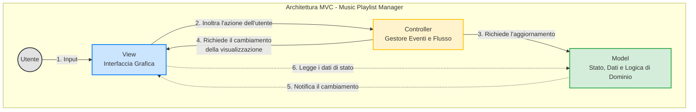

# Design Architetturale e Product Backlog

## Introduzione

Questo documento racchiude le informazioni fondamentali per lo sviluppo dell'applicazione **Music Playlist Manager**. Sono incluse le risorse utilizzate dal gruppo di sviluppo, la *definizione di completezza*, lo *schema architetturale* del sistema ed il *product backlog*

---

## 1. Risorse del Progetto

* **Linguaggio di programmazione**: Java
* **Framework UI**: JavaFX
* **Test Units**: JUnit
* **GitHub**: [Repository Gruppo - 7](https://github.com/luigi-perone/MusicPlayer.git)
* **Trello**: [Bacheca Trello](https://trello.com/invite/b/6a0c3200847d4a8a49bea685/ATTIf4eda6d2ceb3ed6cbe5037e2ab23d077E67C53A4/sad-gruppo-7)

---

## 2. Definition of Done

### Codice

* **Codice compilabile senza errori**: il progetto deve compilare correttamente con il sistema di build Maven.
* **Refactoring effettuato**: il codice deve essere stato migliorato in termini di leggibilità e manutenibilità, senza alterare il comportamento.
* **Dipendenze corrette**: tutte le librerie devono essere dichiarate correttamente nel progetto, senza conflitti.
* **Stile di codice conforme**: il codice rispetta tutte le convenzioni di stile condivise dal gruppo.

### Test

* **Unit test completi e superati**: tutti i test unitari devono essere scritti ed eseguiti con successo.
* **Test di integrazione superati**: i test di integrazione necessari devono essere presenti ed eseguiti con esito positivo.
* **Test dell'interfaccia grafica superati**: i test dell'interfaccia grafica necessari devono essere presenti ed eseguiti con esito positivo.

### Documentazione e commenti

* **JavaDoc completa e aggiornata**: classi, interfacce e metodi pubblici devono essere documentati in modo chiaro.
* **Funzionalità principali commentate**: le funzioni principali sono accompagnate da commenti chiari e concisi.

### Gestione progetto

* **Commit e push corretti**: è stato effettuato il *commit* e il *push* su Git, con messaggi chiari e coerenti.
* **User stories tracciate su Trello**: le funzionalità completate devono essere segnate come *Done* sulla bacheca di Trello.
* **Revisione di gruppo completata**: il team o parte di esso ha letto e approvato il codice risolvendo eventuali conflitti o perplessità.
* **Rispetto del principio DRY**: le nuove funzionalità incluse non sono ripetizioni o duplicazioni di codice già sviluppato.

## 3. Architettura Software Adottata

### 3.1 Scelta dell'Architettura

La struttura architetturale del sistema si basa sul pattern *Model-View-Controller (MVC)*, uno degli approcci più comuni nello sviluppo di applicazioni desktop. Esso fornisce garanzie di separazione delle responsabilità, modularità e manutenibilità del codice.

- **Model**
  Gestisce i dati e lo stato dell'applicazione (libreria dei brani, playlist, modalità di riproduzione), definisce le regole di business rimanendo completamente indipendente dalla View e dal Controller. Fornisce interfacce per la manipolazione e l'accesso allo stato, sfruttando meccanismi di notifica verso gli oggetti osservatori *(Pattern Observer)*.

- **View**
  Responsabile della presentazione grafica del modello all'utente. Visualizza le informazioni provenienti dal Model (libreria, playlist, player, home) senza conoscere la logica di aggiornamento. Cattura gli input dell'utente che interagisce con il sistema.

- **Controller**
  Riceve gli input dell'utente catturati dalla View, richiede l'esecuzione delle operazioni di modifica appropriate al Model ed aggiorna la View di conseguenza.

### 3.2 Organizzazione dei Package
Per massimizzare la coesione e ridurre l'accoppiamento, l'architettura adotta una scomposizione *Package by Feature*.
L'applicazione viene divisa in moduli che riflettono le funzionalità del sistema da realizzare (Es. `track`, `playlist`, `player`).\
Ogni package contiene al proprio interno la micro-architettura MVC: il Modello, la Vista e il Controller legato a ciascuna funzionalità.\
Così facendo, è possibile uno sviluppo indipendente delle feature e l'incapsulamento dei dettagli implementativi (nascosti attraverso la visibilità dei package). 

---

### 3.3 Diagramma Architetturale

---

## 4. Product Backlog

## [US-001] Creazione di una traccia

**story points**: 1

**Come** utente,
**voglio** creare una nuova traccia inserendo titolo, autore, durata, genere e anno di pubblicazione,
**in modo da** riprodurla successivante.

**Criteri di Accettazione:**

- **Dato** che l'utente si trova nell'interfaccia principale,
  **Quando** seleziona l'opzione per aggiungere una traccia,
  **Allora** il sistema apre il form di creazione.
- **Dato** che l'utente ha aperto il form,
  **Quando** compila tutti i campi obbligatori con dati validi e conferma,
  **Allora** la traccia viene salvata e mostrata nella libreria.
- **Dato** che l'utente ha aperto il form,
  **Quando** lascia vuoto almeno un campo obbligatorio e conferma,
  **Allora** il sistema non salva la traccia **E** mostra un messaggio di errore.
- **Dato** che l'utente compila il form,
  **Quando** inserisce una durata non numerica oppure un anno non valido (Ex. maggiore dell'anno corrente) e conferma,
  **Allora** il sistema non salva la traccia **E** mostra un messaggio di errore sul formato dei dati.

---
